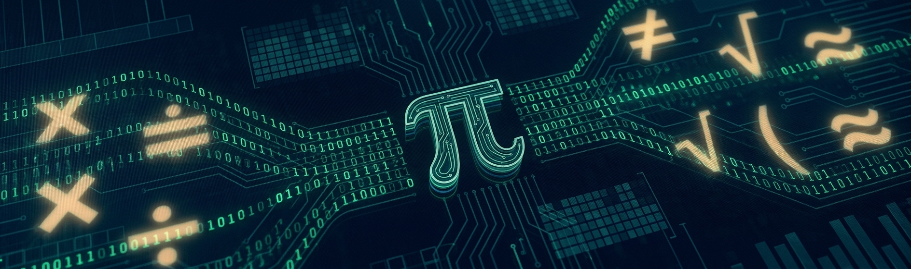

# MathTech Web 🚀



## Matemática Aplicada à Informática

O **MathTech Web** é um projeto educacional desenvolvido para a disciplina **Web Design**, do curso Técnico em Desenvolvimento de Sistemas.

O projeto apresenta conceitos matemáticos fundamentais utilizados na computação, com destaque para sistemas de numeração, lógica matemática e suas aplicações na área de tecnologia.

---

# Objetivo do projeto

O MathTech Web busca integrar:

- Design de interfaces;
- Prototipação;
- Desenvolvimento Web;
- Conteúdo educacional;
- Controle de versão;
- Publicação de sites.

---

# Processo de desenvolvimento

## 1. Prototipação no Figma 🎨

O projeto teve início com a criação de um protótipo visual no Figma.

Nesta etapa foram definidos:

- identidade visual;
- organização das páginas;
- hierarquia dos conteúdos;
- experiência do usuário (UX);
- elementos gráficos;
- distribuição das informações.

O protótipo serviu como referência para as etapas seguintes do projeto.

---

## 2. Desenvolvimento no Lovable 🤖

Após a criação do protótipo, foi desenvolvida uma versão interativa utilizando a plataforma **Lovable**.

Nesta etapa foram trabalhados:

- estrutura visual;
- organização dos conteúdos;
- navegação;
- laboratório interativo;
- experiência do usuário;
- integração de recursos educacionais.

Aplicação desenvolvida no Lovable:

https://mathtechmatematicaplicadainformtica.lovable.app/

---

## 3. Desenvolvimento Web com HTML5, CSS3 e JavaScript 💻

Para a disciplina Web Design, o projeto foi adaptado para uma estrutura tradicional de desenvolvimento Web.

Foram utilizados:

- HTML5;
- CSS3;
- JavaScript;
- páginas HTML separadas;
- folha de estilos compartilhada;
- estrutura organizada de arquivos;
- layout responsivo.

A versão atual mantém a identidade visual definida no projeto original e reproduz, em HTML, CSS e JavaScript, os principais recursos presentes no protótipo e na versão desenvolvida no Lovable.

---

# Estrutura atual do projeto

```text
mathtechweb/
│
├── index.html
├── sobre.html
├── sistemas.html
├── multimidia.html
├── interlab.html
├── cadastro.html
│
├── css/
│   └── estilo.css
│
└── img/
    ├── logo.svg
    ├── capa-mathtech.jpg
    ├── hero-home.jpg
    └── serie-thumb.png
```

---

# Páginas do site

## Início

Apresenta o projeto **Matemática Aplicada à Informática**, seus principais conteúdos e o acesso às demais áreas do site.

## Projeto

Apresenta o objetivo do MathTech, sua proposta educacional e as principais etapas de desenvolvimento.

## Sistemas

Apresenta os principais sistemas de numeração utilizados na computação:

- Decimal;
- Binário;
- Octal;
- Hexadecimal.

A página também possui uma tabela comparativa com bases, símbolos, exemplos e aplicações.

## Multimídia

Apresenta a série educacional **Matemática Aplicada à Informática — Sistemas de Numeração**.

A página utiliza a capa da série e disponibiliza acesso direto à playlist oficial no YouTube.

Playlist:

https://www.youtube.com/playlist?list=PLfN8Om1CaVfU

## Inter-Lab

O **Inter-Lab** é o laboratório interativo do MathTech.

Ele reúne três recursos:

- conversor de sistemas numéricos;
- demonstração de lógica matemática;
- quiz rápido.

O conversor permite transformar um número decimal em:

- binário;
- octal;
- hexadecimal.

A demonstração de lógica permite alterar os valores das proposições **P** e **Q** e observar os resultados das operações:

- AND;
- OR;
- NOT.

O quiz apresenta questões relacionadas aos conteúdos estudados no projeto e informa a pontuação obtida.

## Cadastro

Apresenta um formulário HTML5 com campos comuns de cadastro, como:

- nome completo;
- data de nascimento;
- e-mail;
- telefone;
- cidade;
- estado;
- senha;
- confirmação de senha;
- aceite dos termos.

---

# Evolução do Projeto — Atividade Avaliativa 5

Nesta etapa, o MathTech Web foi ampliado com novos recursos e melhorias de interface.

Foram aplicados conceitos trabalhados na disciplina Web Design, incluindo:

- navegação entre páginas;
- HTML5 semântico;
- CSS externo;
- formulários HTML5;
- tabelas;
- multimídia;
- responsividade;
- organização de arquivos;
- padronização visual;
- interatividade com JavaScript.

Também foi realizada a unificação visual das páginas para que todas façam parte de um único site, mantendo:

- mesma paleta de cores;
- mesma tipografia;
- mesmo cabeçalho;
- mesmo menu de navegação;
- mesmo padrão de cards e botões;
- mesmo rodapé;
- mesma identidade visual.

---

# Identidade visual

A interface utiliza principalmente:

- azul-marinho;
- azul tecnológico;
- branco;
- cinza claro;
- detalhes em ciano.

O objetivo visual é manter uma aparência:

- limpa;
- organizada;
- tecnológica;
- acadêmica;
- responsiva.

---

# Publicação e controle de versão

O projeto utiliza **Git** para controle de versão e **GitHub** para armazenamento do código-fonte.

Repositório:

https://github.com/Vini-Cmos/mathtechweb

Site publicado com GitHub Pages:

https://vini-cmos.github.io/mathtechweb/

---

# Tecnologias utilizadas

- HTML5
- CSS3
- JavaScript
- Git
- GitHub
- GitHub Pages
- Figma
- Lovable

---

# Autor

**Cosme Vinicius Menezes de Oliveira**

Projeto desenvolvido em 2026 para a disciplina **Web Design** do curso Técnico em Desenvolvimento de Sistemas.
